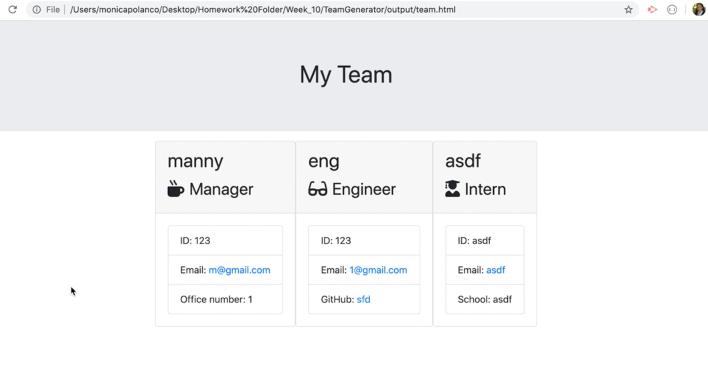

# Team Generator

## Description

The Team Generator is a quick easy way for a manager to generate employee information through the CLI which is then displayed on a website.

## Table of Contents

* [Installation](#installation)

* [Usage](#usage)

* [Tests](#tests)

* [Questions](#questions)

## Installation

```npm install```

## Usage


```node app.js```

```? Manager, what is your name?  Monica Polanco```

https://share.getcloudapp.com/bLuevvpA

## Tests
 
To run tests, run the following command:

```npm run test```

## Questions


Mónica Polanco Fabián | MonicaPolancoFabian15@gmail.com
